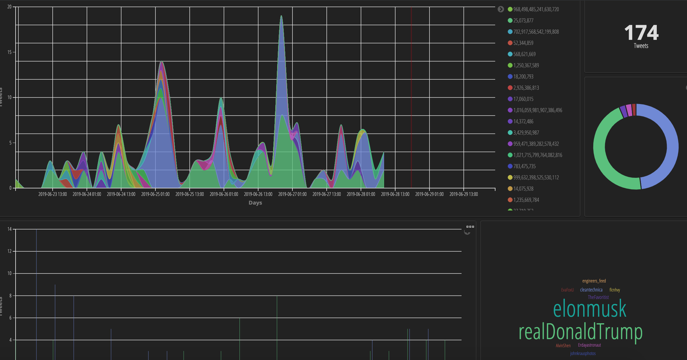

# ELASTIC, KIBANA & TWINT IN ONE BUNDLE 


## SET UP IN 3 STEPS 
 

1. Clone this repo and cd into it 
2. run `docker-compose up -d`
3. Go make a cup of tea, come back and check everything works by going to `localhost:9200` for elastic or `localhost:5601` for kibana

### You are done :)

  
# Twitter Bulk profiling

**(If this approach doesn't work, skip to the next heading - which is manual process)**

1. Make sure you are at base directory (where you can see injector.sh)
2. Run `chmod u+x injector.sh` 
3. Run `python inject_data.py` and follow the steps *(I suggest only chose 1 profile to scan initially)*


Now lets prepare Kibana so you can visualzie it:  
 
Go to `Management tab`, Index Patterns, Create Index Pattern, Index Pattern: twinttweets and choose datestamp as time field; 


  


# Twitter profiling

1. If you want to do Twitter analytics, run `docker ps` and copy the *CONTAINER ID* for the twint container
2. SSH onto the container `docker exec -it CONTAINER ID bash `
3. Once in,  run the below commands (bulk copy and paste is fine) to populate elastic, you can run as many times as you like with any twitter handle.


```
twint -u elonmusk  -es elasticsearch:9200 --limit 50
twint -u elonmusk  --followers -es elasticsearch:9200 --limit 50
twint -u elonmusk  --following -es elasticsearch:9200 --limit 50
twint -u elonmusk  --favorites -es elasticsearch:9200 --limit 50
twint -u elonmusk  --stats -es elasticsearch:9200 --limit 50
twint -u elonmusk  --stats --limit 50
```

Now lets prepare Kibana so you can visualzie it:  
 
Go to `Management tab`, Index Patterns, Create Index Pattern, Index Pattern: twinttweets and choose datestamp as time field; 


  


# READY TO GO DASHBOARD



To use them you have just to import them: go to Management tab (the gear), Saved Objects, Import and then select visualizations.json, repeat the process for dashboard.json. After this just to go Dashboard tab and click on Twint Dashboard to see the cool visualizations. Don't forget to ensure the time filter on kibana is longer than the last 15 minutes.


Powered by [twint](https://github.com/twintproject/twint)